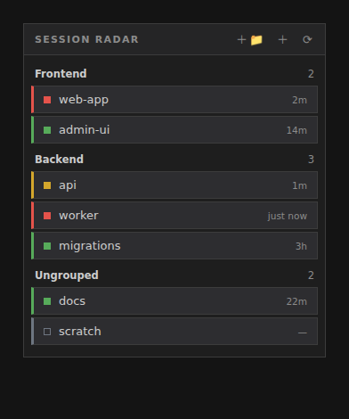

# session-radar

**See every Claude Code session at a glance — and jump to any of them.**

A VS Code extension for running **many Claude Code (CLI) sessions in tmux** — especially on a remote / WSL host accessed over VS Code Remote / SSH / Tunnel. It shows each session's live status in a side panel, lets you organize sessions into groups, and opens or focuses any session with one click.



## Why

If you keep a bunch of Claude Code sessions running (one per project, in tmux), it's hard to tell which one is busy, which is waiting for your input, and which is idle — and tab/terminal lists don't show that. session-radar reads each session's state and puts it all on one panel.

## Features

- **Two views, your choice** — a native **tree** view and a compact **card** view, side by side (collapse whichever you don't use).
- **Live status** per session:
  - 🔴 **working** — Claude is processing
  - 🟡 **waiting** — Claude needs your input (a question / permission)
  - 🟢 **idle** — finished, your turn
  - ⚪ **unknown** — no status yet
- **Auto-discovery** — every running tmux session shows up automatically; organize them into your own groups.
- **Open or jump** — click a session to focus its terminal if it's open, otherwise open a new one attached to it (`tmux new-session -A` — attach if it exists, create if not).
- **Manage from either view** — create / rename / delete groups, rename (display alias) / hide / add sessions, and **drag-and-drop** to reorder or regroup.
- **Keyboard** — in the card view, ↑/↓ to move, Enter to open.
- **Persistent** — your groups, order, and aliases survive restarts.
- **Safe** — real tmux sessions are **never killed or renamed**. "Rename" sets a display-only alias; "delete" just hides from the list.

## How it works

A small Claude Code **hook** writes each session's state to `~/.claude/session-status/<name>.json` whenever it changes. The extension watches that folder and renders the panel. Your layout (groups, order, aliases, hidden) lives in `~/.claude/session-radar/layout.json` (atomic writes with a backup).

The identity key throughout is the **tmux session name** (= the terminal name = the status-file name), so status, grouping, and "jump" all line up.

```
Claude hook ─▶ ~/.claude/session-status/<name>.json ─▶ extension watches ─▶ panel
layout.json (groups / order / aliases) ─────────────────────────────────┘
click a session ─▶ focus its terminal, or open `tmux new-session -A -s <name>`
```

The extension runs in the **remote (WSL) extension host** so it can read those files and reach the terminals.

## Install

See **[docs/INSTALL.md](docs/INSTALL.md)**: build the `.vsix`, drop in the hook script, wire the hooks (existing hooks are preserved), and install the extension on the remote host.

Quick version:

```bash
npm install && npm run build && npm run package      # → session-radar.vsix
cp scripts/session-status.sh ~/.claude/session-status.sh && chmod +x ~/.claude/session-status.sh
node scripts/install-hooks.mjs                        # adds hooks, backs up settings.json
# then: VS Code → "Extensions: Install from VSIX…" → session-radar.vsix → Reload Window
```

## Notes

- "waiting" detection relies on Claude Code hook events; the exact events that fire can vary by setup (see `scripts/install-hooks.mjs` for the wired events).
- Drag/grouping live in the panel; tmux itself is only ever read (`list-sessions`) or attached-to (`new-session -A`).
- Personal tool, shared as-is. Built and validated with a plan → review → test workflow.

## License

No license yet — treat as all-rights-reserved unless one is added.
