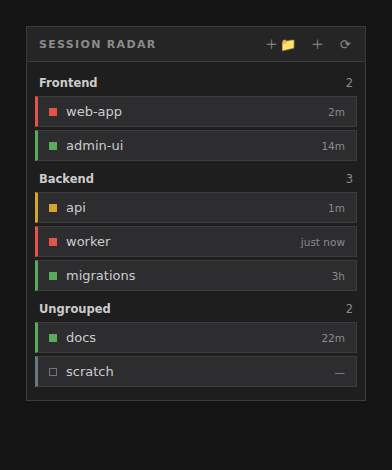

# session-radar

**See every Claude Code session at a glance — and jump to any of them.**

A VS Code extension for running **many Claude Code (CLI) sessions in tmux** — especially on a remote / WSL host accessed over VS Code Remote / SSH / Tunnel. It shows each session's live status in a side panel, lets you organize sessions into groups, and opens or focuses any session with one click.



*(Screenshot predates the current card design and status colours.)*

## Requirements

session-radar is **not a standalone tool** — it visualizes and controls terminals for a specific setup. Installing it from the Marketplace alone will show an empty panel until you complete a one-time setup:

- **[Claude Code](https://claude.com/claude-code) (CLI)** running in **tmux** sessions.
- `tmux` on the host, reachable from the extension host (status is read with `tmux list-panes`). No hook or agent to install.
- Usually a **remote / WSL host** reached over VS Code Remote (SSH / Tunnel / WSL), where the extension runs in the remote extension host.

See **[docs/INSTALL.md](docs/INSTALL.md)** for the one-time setup. Without tmux, the panel has nothing to show.

## Why

If you keep a bunch of Claude Code sessions running (one per project, in tmux), it's hard to tell which one is busy, which one is waiting on you, and which one is doing nothing: tab and terminal lists don't show that. session-radar reads each session's state and puts it all on one panel.

## Features

- **Two views, your choice** — a native **tree** view and a compact **card** view, side by side (collapse whichever you don't use).
- **Live status** per session, read from the tmux pane title Claude itself sets:
  - **spinning ring (green)** — *working*: Claude is processing (its tmux title shows the animated braille spinner)
  - **filled dot (yellow)** — *turn*: your turn. Claude is running with the spinner stopped, so it either answered or is asking you something
  - **hollow dot (grey)** — *inactive*: Claude isn't running there (a plain shell)
  - **hollow dot (grey)** — *unknown*: no tmux session by that name right now. Usually it ended (or the machine rebooted) and the name is still on your list, so "목록에서 삭제" clears it. It also covers tmux being unreadable (not installed / no server / timed out).
- **Auto-discovery** — every running tmux session shows up automatically; organize them into your own groups.
- **Open or jump** — click a session to focus its terminal if it's open, otherwise open a new one attached to it (`tmux new-session -A` — attach if it exists, create if not).
- **Split & close from the panel** — right-click → **"분할로 열기"** opens a session **tiled side-by-side in the editor area**; **"분할 닫기"** closes its terminal — a tmux **detach**, so the session stays alive and listed. Manage terminals from session-radar without touching VS Code's own terminal tabs.
- **Open indicator (●)** — sessions that currently have a live terminal show a ● in both views, updated as terminals open and close.
- **Terminal location** — `sessionRadar.terminalLocation`: `panel` (default — terminals in the bottom panel, code stays the main area) or `editor` (terminals in the main editor area — handy when terminals *are* your main work). "분할로 열기" always tiles in the editor area.
- **Project paths** — assign a folder to a session (right-click → "프로젝트 경로 지정"); newly-created sessions start in that folder (`tmux new-session -c`). Existing sessions just reattach, unchanged. Hover a session to see its path.
- **Auto-reconnect** — on VS Code start/reload, the sessions you've opened reopen automatically. The list lives in `~/.claude/session-radar/open.json` (on the WSL host), so it even survives switching between VS Code Tunnel and Remote-SSH. Toggle with the `sessionRadar.autoReconnect` setting. It runs **only in windows where the session-radar view has been shown**, so a second window (or a phone on the Tunnel) doesn't attach to the same tmux sessions behind your back.
- **Images side-by-side from the terminal** — Ctrl+click an image path in the terminal and it opens **tiled in the next editor column** instead of stacking as another tab, so a batch of screenshots lands next to each other. Focus stays in the terminal, so you can click several links in a row. `sessionRadar.imageColumns` (default `3`) sets how many columns to spread across before reusing the leftmost; `sessionRadar.imageSplitOnClick` (default `true`) turns the whole thing off. Paths that don't resolve to a real file are left to VS Code's built-in handling.
- **Image compare panel** — **"이미지 나란히 보기"** collects image paths from your clipboard (or a file picker) into one grid panel with an adjustable column count and click-to-zoom. **"이미지 비교에 추가"** appends to it.
- **Manage from either view** — create / rename / delete groups, rename (display alias) / hide / add sessions, and **drag-and-drop** to reorder or regroup.
- **Keyboard** — in the card view, ↑/↓ to move, Enter to open.
- **Persistent** — your groups, order, and aliases survive restarts.
- **Safe** — real tmux sessions are **never killed or renamed**. "Rename" sets a display-only alias; "delete" just hides from the list.

## How it works

Every few seconds the extension runs `tmux list-panes` across all sessions and reads each pane's **foreground command and title**. Claude Code puts an animated braille spinner in its title while it is working and a `✳` when it is your turn, so the title alone tells the state: no hook, no daemon, nothing writing files. A session with several panes takes its strongest state (working > turn > inactive). Your layout (groups, order, aliases, hidden) lives in `~/.claude/session-radar/layout.json` (atomic writes with a backup).

The identity key throughout is the **tmux session name** (= the terminal name), so status, grouping, and "jump" all line up.

```
tmux list-panes (command + title) ─▶ extension polls ─▶ panel
layout.json (groups / order / aliases) ─────────────┘
click a session ─▶ focus its terminal, or open `tmux new-session -A -s <name>`
```

The extension runs in the **remote (WSL) extension host** so it can read those files and reach the terminals.

## Install

See **[docs/INSTALL.md](docs/INSTALL.md)**: build the `.vsix` and install it on the remote host.

Quick version:

```bash
npm install && npm run build && npm run package      # → session-radar.vsix
# then: VS Code → "Extensions: Install from VSIX…" → session-radar.vsix → Reload Window
```

## Notes

- Status comes from the tmux pane title, so a session whose title Claude doesn't set (or a terminal not started through tmux) shows as **inactive** even if something is running in it.
- Drag/grouping live in the panel; tmux itself is only ever read (`list-sessions`) or attached-to (`new-session -A`).
- **Auto-reconnect list** only shrinks via "목록에서 삭제" (hide) — closing a terminal tab keeps the session on the list (so a reload always brings it back). If a session was ended or the machine rebooted, it may reopen as an empty shell; hide it to stop that. For the cleanest behavior you can also disable VS Code's own terminal restore (`terminal.integrated.enablePersistentSessions: false`) so session-radar is the sole opener.
- With two VS Code windows open at once (e.g. Tunnel **and** Remote-SSH), the shared `open.json` is best-effort — a simultaneous change in one window may not be reflected in the other.
- **Image links and wrapped lines** — the terminal splits a long path across two visual lines when the panel is narrow, and each half is treated as its own line, so neither half resolves to a real file and the link is left to VS Code. Keeping the terminal in the bottom panel (`sessionRadar.terminalLocation: panel`, the default) avoids this, since opening images in editor columns doesn't steal its width.
- Personal tool, shared as-is. Built and validated with a plan → review → test workflow.

## License

[MIT](LICENSE) © 2026 non2xx
